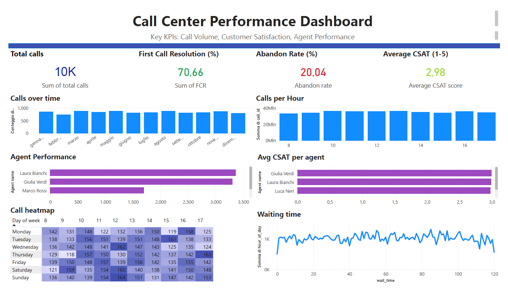

# Call Center KPI Dashboard
This project analyzes call center performance using PostgreSQL and Power BI, focusing on key operational metrics and agent efficiency.

### Objectives
- Monitor key KPIs such as FCR, Abandon Rate and CSAT
- Evaluate agent performance
- Identify call patterns over time
- Analyze call distribution by hour and day

### Dashboard preview

### KPIs Included
- Total calls: total number of incoming calls
- Abandon Rate (%): % of calls dropped before being answered
- First Call Resolution (FCR %): % of issues resolved on first contact
- Customer Satisfaction (CSAT): average satisfaction score

### Analysis Performed
- Calls trend over time (monthly view)
- Call distribution by hour (peak hours analysis)
- Agent performance based on FCR
- Heatmap of calls by day of week and hour

### Tools Used
- PostreSQL
- Power BI

### Future Improvements
- Add Service Level KPI
- Introduce more realistic datasets
- Improve agent-level insights

### About
This project was built as part of a data analytics portfolio to demonstrate skills in SQL, data modeling and business intelligence.
