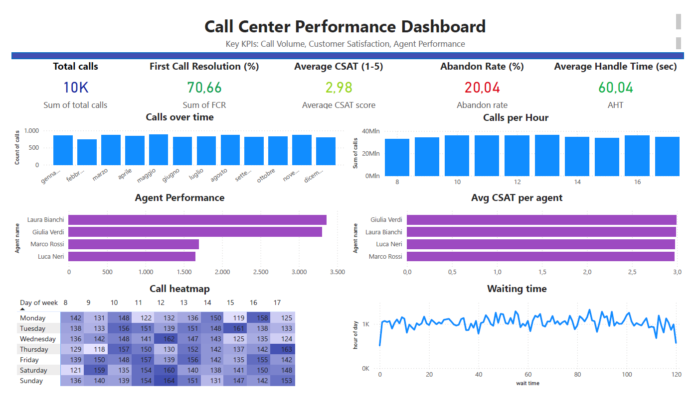

## Dashboard Overview

This project analyzes call center performance using PostgreSQL and Power BI, combining operational KPIs with time-based and agent-level analysis.

### Key Features
- **KPI Monitoring**  
  Real-time overview of core metrics: Abandon Rate, CSAT, FCR, and Average Handle Time

- **Time-Based Analysis**  
  Identification of peak hours and call volume patterns across days and months

- **Agent Performance Tracking**  
  Comparison of agents based on handled calls and First Call Resolution

- **Workload Distribution**  
  Visualization of call concentration using hourly and weekly heatmaps

## Analysis Highlights

- Identified peak demand periods through hourly call distribution  
- Detected workload imbalance across agents  
- Observed variability in waiting times impacting abandonment  
- Highlighted gaps in First Call Resolution affecting repeat calls  

## Tools Used
- PostgreSQL  
- Power BI  

## Potential Improvements

- Introduce Service Level (SL) KPI for queue performance 
- Enhance agent-level analysis with CSAT segmentation  
- Add forecasting for call volume trends  
